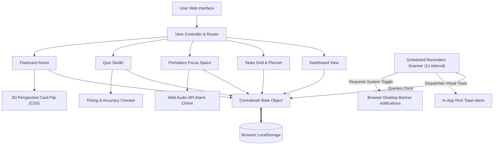

# AetherStudy (studyBuddy) - Premium Study Planner & Productivity Suite

AetherStudy (also known as **studyBuddy**) is a premium, modern, and highly interactive Single-Page Application (SPA) designed to elevate student focus and learning. Built entirely with semantic HTML5, CSS3 (Midnight Glassmorphism design), and native JavaScript, it requires zero external dependencies, is extremely fast, and respects privacy by keeping all user data persisted in the browser's `localStorage`.

---

## 🗺️ System Flow Diagram

Here is a structural overview of the AetherStudy application flow, state coordination, and browser service integrations:



---

## 🔄 Core Application Workflows

### 1. Unified State & Storage Sync
1. On page load, the application initializes and calls `loadStateFromLocalStorage()`.
2. If state exists, it is loaded; otherwise, a robust set of mock tasks, quizzes, flashcards, and stats are populated.
3. Every mutating action (adding a task, completing a quiz, reviewing flashcards) automatically updates the central `state` object and triggers `saveStateToLocalStorage()`, keeping the interface and cache synchronized.

### 2. Tab Routing Lifecycle
1. The sidebar menu buttons capture user clicks.
2. The View Router intercepts the event, hides the previous active section, adds the `.active` class to the requested viewport, and triggers keyframe entry animations.
3. Upon routing to a page, a specific renderer (e.g. `renderDashboard()`) is fired to populate lists and values in real-time.

### 3. Pomodoro Execution & Chime Synthesis
1. Selecting a mode (Focus, Short Break, Long Break) resets the elapsed time based on user settings.
2. Starting the timer sets up a drift-corrected interval checking relative timestamps.
3. If a Focus session completes, focus scores are credited, session metrics are logged, and the browser's **Web Audio API** is called. It synthesizes a three-tone sound wave programmatically to alert the user without fetching bulky external media.
4. The system automatically transitions the user to the next appropriate interval (Short Break vs Long Break).

### 4. Quiz Maker & Play Session
1. **Creation**: The Quiz Builder lets users dynamically append questions and define four options, specifying the correct choice via radio buttons.
2. **Review**: Starting a quiz starts a 15-second visual countdown timer.
3. **Execution**: Selection freezes options, colors button borders (Green for Correct, Red for Incorrect), awards focus points, and reveals a "Next Question" handle.
4. **Grading**: Once complete, percentage metrics are calculated, compared against the high score, and cached.

---

## 📖 Detailed User Guide

### Running Locally
To run the server and explore the study buddy, launch the background server:
```bash
python -m http.server 8000
```
Then, open your web browser and navigate to: **[http://localhost:8000](http://localhost:8000)**

### Using the Features

#### 📅 Dashboard Overview
- View your **Focus Score**, total daily study time, completed tasks, and average quiz scores.
- Double-click the **Focus Shortcut** button to start a Pomodoro immediately.
- Read your daily motivational quote at the top.

#### 📝 Tasks & Planner
1. Click **Create Task** to open the modal.
2. Input Title, Description, Subject Tag, Priority, and Due Date.
3. Use the filters on the left side to show tasks based on completion status, priority tier, or tags.
4. Tick the checkbox on any task card to cross it out and earn **+15 Focus Points**.

#### ⏱️ Pomodoro Space
- Customize focus and break times in the **Focus Settings** panel and click **Update Settings**.
- Click **Play** to start focusing. A circular gradient path will shrink as time ticks down.
- Toggle between Work, Short Break, or Long Break modes manually if needed.

#### 🧠 Quiz Builder
- Click **New Quiz**, type a title and subject, then build your questions.
- Click **Add Question** to include more questions.
- Once saved, your quiz card will appear. Click **Start Quiz** to take the challenge.

#### 🗂️ Flashcard Study
- Add a new deck via **New Card Deck**.
- Under study view, click the 3D card body to perform a smooth flip rotation and reveal the answer.
- Self-grade your progress with the **Got It!** and **Still Learning** buttons to refine retention statistics.

---

## 🐙 How to Push this Repository to GitHub (studyBuddy)

Since you have Git installed, follow these steps to upload AetherStudy (studyBuddy) to your GitHub account:

### Step 1: Create a Repository on GitHub
1. Log in to [GitHub](https://github.com).
2. Click **New** (or "+" in the top right) to create a repository.
3. Name your repository **`studyBuddy`**.
4. Leave it empty (do **NOT** initialize with a README, `.gitignore`, or license, as we have already created these).
5. Click **Create Repository**.

### Step 2: Link and Push via Terminal
Open your terminal (PowerShell, CMD, or Git Bash) inside the project directory `c:\Users\ASUS\Desktop\cintrack` and execute the following commands:

```powershell
# 1. Link your local project to the GitHub remote repository
git remote add origin https://github.com/YOUR_GITHUB_USERNAME/studyBuddy.git

# 2. Rename default branch to main
git branch -M main

# 3. Push the codebase to GitHub
git push -u origin main
```
*(Replace `YOUR_GITHUB_USERNAME` with your actual GitHub account name.)*
